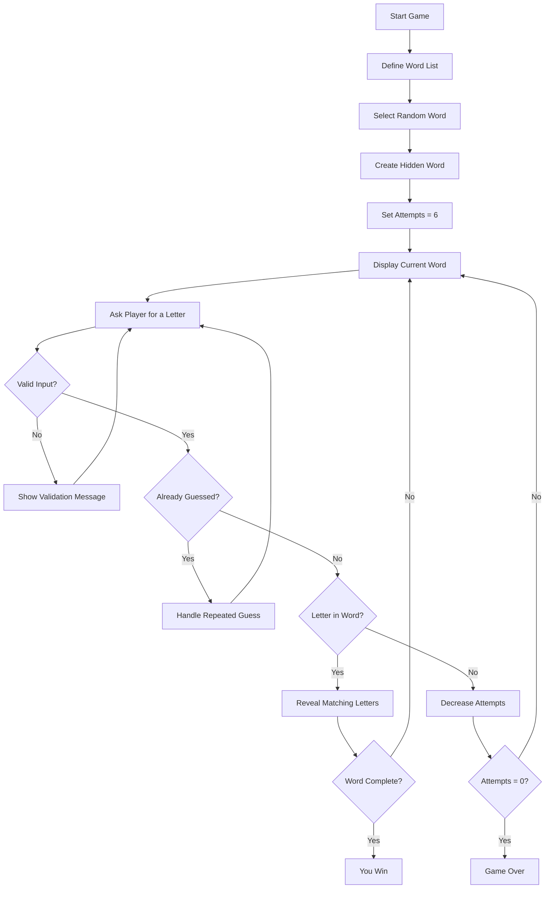
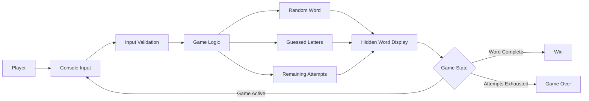
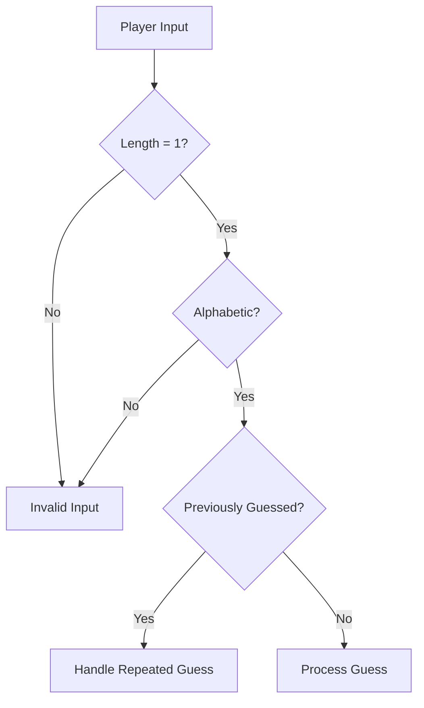

# 🐍 CodeAlpha Python Tasks

> Python programming tasks completed as part of the **CodeAlpha Internship Program**, focused on strengthening Python fundamentals through practical problem-solving and interactive console applications.

---

## 📌 About

This repository contains Python work completed during the CodeAlpha internship.

The current project demonstrates a **console-based Hangman game** implemented using Python's built-in modules and fundamental programming concepts.

The application randomly selects a word from a predefined collection and challenges the player to reveal the word by guessing individual letters within a limited number of incorrect attempts.

---

# 🎯 Internship Objective

The project focuses on applying core Python concepts in a practical task:

- Variables and data types
- Lists
- Strings
- Loops
- Conditional statements
- Functions
- User input handling
- Random selection
- Validation
- Game-state management
- Basic problem solving

---

# 🎮 Project: Hangman Game

The Hangman game selects a random word from a predefined list.

### Available words

```text
python
java
coding
openai
developer
```

The selected word is initially hidden from the player.

The player must guess letters one at a time.

```text
Selected Word
      │
      ▼
Hide Letters
      │
      ▼
Display "_" for unknown letters
      │
      ▼
Player enters a letter
      │
      ▼
Check the guess
   ┌──┴───────────┐
   │              │
Correct        Incorrect
   │              │
   ▼              ▼
Reveal letter   Attempts - 1
   │              │
   └──────┬───────┘
          ▼
   Check game state
```

---

# ✨ Features

## 🎲 Random Word Selection

The game uses Python's `random` module to select one word from the predefined word list.

```python
word = random.choice(words)
```

This makes each game different.

---

## 🔤 Letter Guessing

The player enters one character at a time.

For every correct guess, all matching positions in the word are revealed.

Example:

```text
Word: python

Initial:
_ _ _ _ _ _

Guess:
t

Updated:
_ _ t _ _ _
```

---

## ❌ Limited Attempts

The player receives a maximum of:

```text
6 incorrect guesses
```

Every incorrect guess decreases the remaining attempt count.

```text
6 → 5 → 4 → 3 → 2 → 1 → 0
```

When the count reaches zero, the game ends.

---

## 🛡️ Input Validation

The game validates user input before processing the guess.

It checks that:

- The input is a single character.
- The character is alphabetic.
- Previously guessed letters are handled appropriately.

This prevents invalid input from unnecessarily affecting the game.

---

## 🏆 Win Detection

The game continuously checks whether every character in the selected word has been revealed.

If the complete word is guessed:

```text
🎉 You won!
```

The game ends successfully.

---

## 💀 Game Over Detection

If the player uses all six incorrect attempts before completing the word:

```text
Game Over!
The word was: <selected_word>
```

The hidden answer is then revealed.

---

# 🔄 Game Workflow



---

# 🧠 Program Logic

The application follows a simple game-state loop:

```text
Initialize
    │
    ├── Select random word
    ├── Hide word
    └── Set incorrect attempts to 6
             │
             ▼
        Guessing Loop
             │
             ├── Read input
             ├── Validate input
             ├── Check guessed letter
             │
             ├── Correct
             │      └── Reveal letter
             │
             └── Incorrect
                    └── Reduce attempts
             │
             ▼
      Check Win / Game Over
```

---

# 🧩 Core Python Concepts Used

| Concept | Application |
|---|---|
| `import random` | Random word selection |
| List | Stores possible words |
| `random.choice()` | Selects the game word |
| `input()` | Reads player guesses |
| `while` loop | Maintains the game loop |
| `if / elif / else` | Controls game decisions |
| String operations | Builds and checks the hidden word |
| Membership checking | Determines whether a letter exists |
| Variables | Stores game state |
| Conditional validation | Handles invalid guesses |

---

# 🏗️ Program Architecture

Although this is a small console application, its logical architecture can be represented as:



---

# 📁 Repository Structure

```text
CodeAlpha-Python-Tasks/
│
├── python task1/
│   └── hangman.py
│
└── README.md
```

> The repository structure reflects the CodeAlpha task organization. The task folder contains the Python implementation.

---

# ⚙️ Requirements

The project requires:

```text
Python 3.x
```

No external Python packages are required for the Hangman implementation.

The application uses Python's built-in:

```python
random
```

module.

---

# 🚀 Getting Started

## 1. Clone the repository

```bash
git clone https://github.com/Naveenbabu45/CodeAlpha-Python-Tasks.git
```

## 2. Navigate into the repository

```bash
cd CodeAlpha-Python-Tasks
```

## 3. Open the task directory

```bash
cd "python task1"
```

## 4. Run the game

```bash
python hangman.py
```

Depending on the Python installation, you can also use:

```bash
python3 hangman.py
```

---

# 🖥️ Example Gameplay

```text
Welcome to Hangman!

_ _ _ _ _ _

Guess a letter: p

p _ _ _ _ _

Guess a letter: y

p y _ _ _ _

Guess a letter: z

Wrong guess!
Remaining attempts: 5

Guess a letter: t

p y t _ _ _

...
```

A successful game ends when the entire word has been revealed.

```text
🎉 Congratulations!
You guessed the word!
```

An unsuccessful game ends when all six incorrect attempts are consumed.

```text
Game Over!
The word was: python
```

---

# 🔍 Validation Flow

The input validation process can be represented as:



This keeps invalid input from entering the main game logic.

---

# 📊 Game State

The main state of the application consists of:

```text
Selected Word
     │
     ├── Hidden characters
     │
     └── Target word

Guessed Letters
     │
     └── Letters already attempted

Attempts
     │
     └── Maximum incorrect attempts = 6

Game Status
     │
     ├── Active
     ├── Won
     └── Game Over
```

---

# 🎯 Learning Outcomes

Through this task, the project demonstrates practical understanding of:

### Python Fundamentals

- Variables
- Strings
- Lists
- Conditions
- Loops
- User input

### Problem Solving

- Breaking a problem into smaller operations
- Maintaining application state
- Validating user input
- Handling multiple game outcomes

### Python Standard Library

- Using the `random` module
- Selecting random values from collections

### Interactive Programming

- Designing a command-line interaction
- Providing feedback after each user action
- Handling invalid input gracefully

---

# 🛣️ Future Enhancements

Possible improvements for a future version:

- [ ] Add multiple difficulty levels
- [ ] Add a larger word dictionary
- [ ] Add categories such as Programming, Movies, Sports, etc.
- [ ] Add ASCII Hangman graphics
- [ ] Track total wins and losses
- [ ] Add replay functionality
- [ ] Add score calculation
- [ ] Add hints
- [ ] Add a maximum word length setting
- [ ] Improve repeated-guess messages
- [ ] Convert the console game into a GUI
- [ ] Build a web version using Flask or FastAPI
- [ ] Add persistent leaderboard storage

---

# 🧪 Testing Scenarios

| Scenario | Expected Behavior |
|---|---|
| Correct letter | Reveal matching character(s) |
| Incorrect letter | Reduce remaining attempts |
| Number entered | Reject invalid input |
| Multiple characters | Reject invalid input |
| Special character | Reject invalid input |
| Repeated letter | Handle repeated guess |
| All letters guessed | Display win state |
| Six incorrect guesses | Display game-over state |

---

# 📌 Project Status

```text
Status: Completed
Type: CodeAlpha Internship Task
Category: Python Programming
Application: Console-based Hangman Game
```

---

# 💼 Internship Context

This project is part of the **CodeAlpha Internship** task collection.

The repository is maintained separately to document internship-based programming practice and demonstrate hands-on experience with Python fundamentals.

---

# 👨‍💻 Author

**Naveen Babu**

B.Tech Computer Science & Engineering Student

- GitHub: https://github.com/Naveenbabu45
- LinkedIn: https://www.linkedin.com/in/kommmavarupanaveenbabu
- Portfolio: https://naveen-portfolio-swart-rho.vercel.app/

---

# 🔗 Repository

**GitHub:**  
https://github.com/Naveenbabu45/CodeAlpha-Python-Tasks

---

## ⭐ Summary

**CodeAlpha-Python-Tasks** documents Python programming work completed during the CodeAlpha internship.

The current task, **Hangman**, is a simple but practical console application that demonstrates random selection, loops, conditions, input validation, string processing, and game-state management.

```text
             CODEALPHA PYTHON TASK
                       │
                       ▼
                 HANGMAN GAME
                       │
          ┌────────────┼────────────┐
          ▼            ▼            ▼
      Random Word   User Input   Attempts
          │            │            │
          └────────────┼────────────┘
                       ▼
                  Game Logic
                       │
                ┌──────┴──────┐
                ▼             ▼
              WIN          GAME OVER
```

> Built as part of practical Python development and problem-solving work during the CodeAlpha Internship.
